# SteganoTool Enhanced - Technical Report

## Executive Summary

SteganoTool Enhanced is a comprehensive steganography application that enables secure message hiding within digital media files. The system combines advanced encryption techniques (AES-256-CBC) with Least Significant Bit (LSB) steganography to provide a robust solution for covert data transmission. The application supports multiple media types including images (PNG, JPG, BMP), audio files (WAV), and QR codes, with both web-based and command-line interfaces.

**Version:** 1.0  
**Date:** 2024  
**Technology Stack:** Python 3.8+, Flask, PyCryptodome, Pillow, OpenCV

---

## Table of Contents

1. [Project Overview](#1-project-overview)
2. [System Architecture](#2-system-architecture)
3. [Core Functionalities](#3-core-functionalities)
4. [Technical Flows](#4-technical-flows)
5. [Security Architecture](#5-security-architecture)
6. [API Design](#6-api-design)
7. [Data Formats](#7-data-formats)
8. [Implementation Details](#8-implementation-details)

---

## 1. Project Overview

### 1.1 Purpose

SteganoTool Enhanced provides a secure platform for hiding encrypted messages within digital media files. The application ensures that hidden data remains undetectable while maintaining the visual/audible integrity of carrier files.

### 1.2 Key Features

- **Multi-Media Support**: Images (PNG, JPG, BMP), Audio (WAV), and QR Codes
- **Strong Encryption**: AES-256-CBC with PBKDF2 key derivation
- **Data Compression**: Automatic zlib compression for efficiency
- **Password Management**: Auto-generation or custom passwords with optional embedding
- **Dual Interface**: Web-based GUI and command-line client
- **Format Conversion**: Automatic conversion between formats for optimal steganography
- **VirusTotal Integration**: URL security scanning capabilities

### 1.3 Technology Stack

| Component | Technology |
|-----------|-----------|
| Backend Framework | Flask 2.2.3 |
| Encryption Library | PyCryptodome 3.17.0 |
| Image Processing | Pillow 9.4.0, NumPy 1.24.2, OpenCV 4.7.0.72 |
| QR Code Generation | qrcode 8.0.0, pyzbar 0.1.9 |
| Audio Processing | wave, FFmpeg |
| Compression | zlib |
| Web Interface | Bootstrap 5, JavaScript |

---

## 2. System Architecture

### 2.1 High-Level Architecture

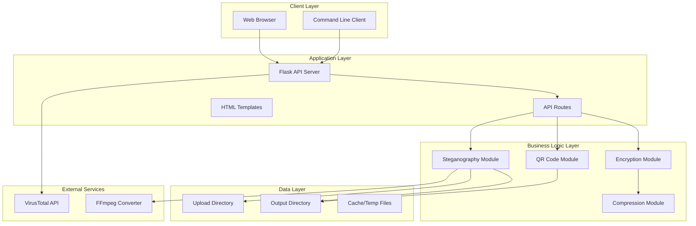

### 2.2 Component Architecture

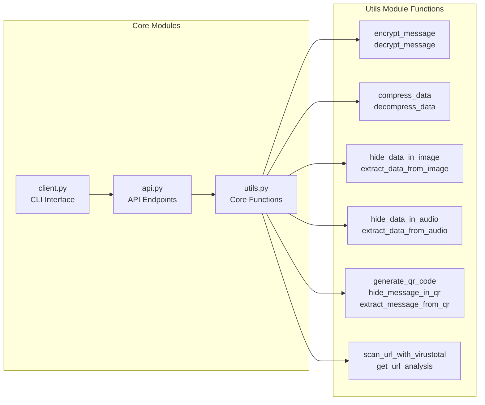

---

## 3. Core Functionalities

### 3.1 Encryption & Decryption

The system implements a dual-encryption strategy:
- **Short messages (<32 bytes)**: XOR encryption with SHA-256 key derivation
- **Standard messages**: AES-256-CBC encryption with PBKDF2 key derivation

### 3.2 Steganography Techniques

- **LSB (Least Significant Bit)**: Primary technique for images and audio
- **QR Code Encoding**: Direct data encoding in QR code structure
- **Multi-channel embedding**: Data distributed across RGB channels for images

### 3.3 Media Processing

- **Image Processing**: Automatic format conversion (JPG→PNG), RGB normalization
- **Audio Processing**: Format conversion to WAV, sample-based embedding
- **QR Code Processing**: Generation with multiple styles, background image support

---

## 4. Technical Flows

### 4.1 Overall Encryption & Hiding Flow

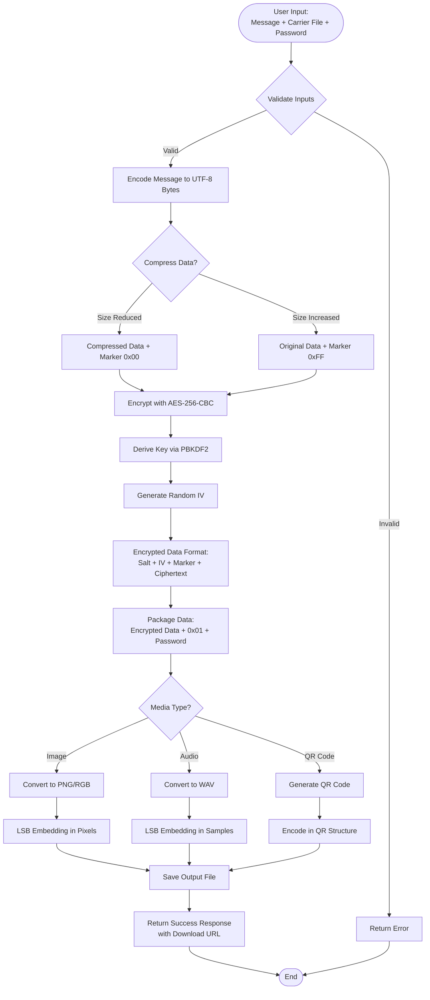

### 4.2 Decryption & Extraction Flow

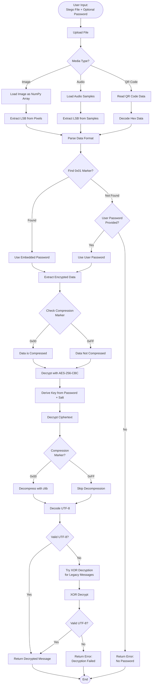

### 4.3 Image Steganography Flow

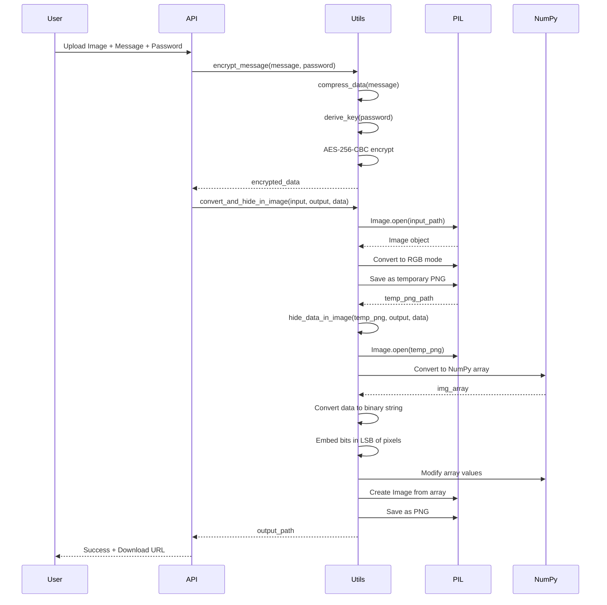

### 4.4 Audio Steganography Flow

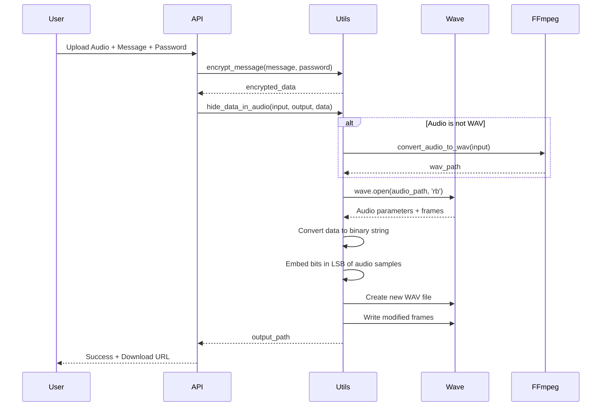

### 4.5 QR Code Steganography Flow

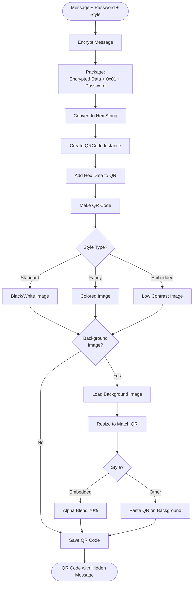

### 4.6 API Request Flow

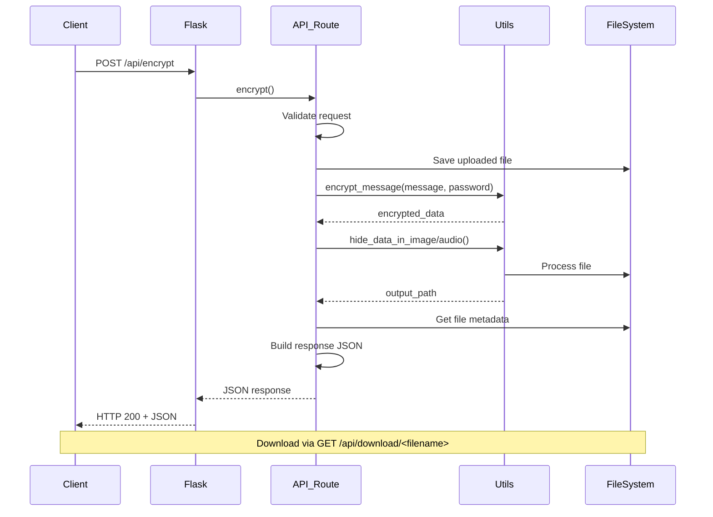

### 4.7 Data Format Structure

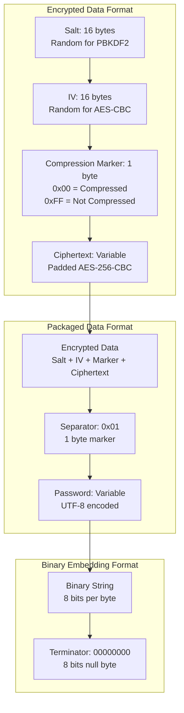

---

## 5. Security Architecture

### 5.1 Encryption Security

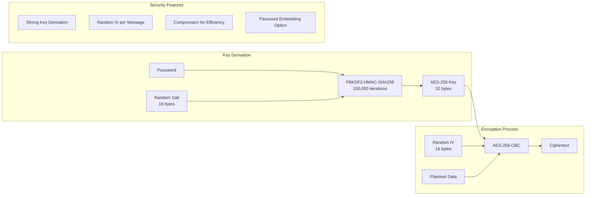

### 5.2 Steganography Security

- **LSB Technique**: Minimal visual/audible impact
- **Multi-channel Distribution**: Data spread across RGB channels
- **Format Preservation**: Output maintains original format characteristics
- **Capacity Validation**: System checks if carrier can hold data before processing

---

## 6. API Design

### 6.1 API Endpoints

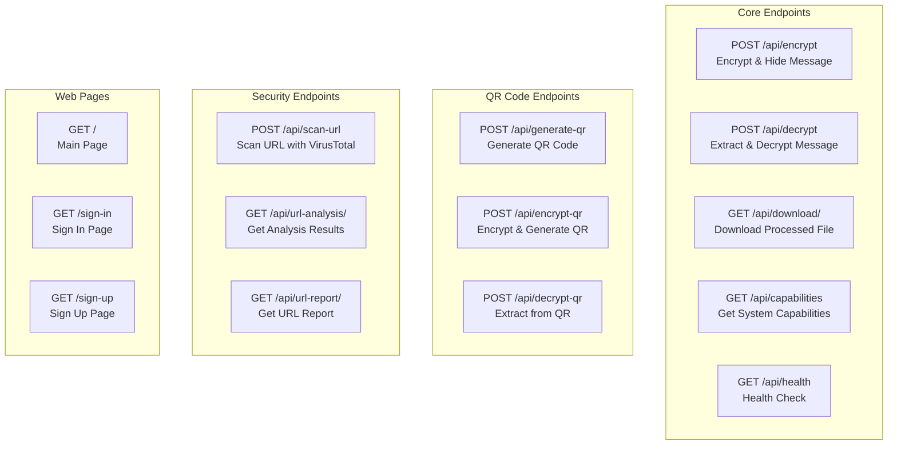

### 6.2 Request/Response Flow

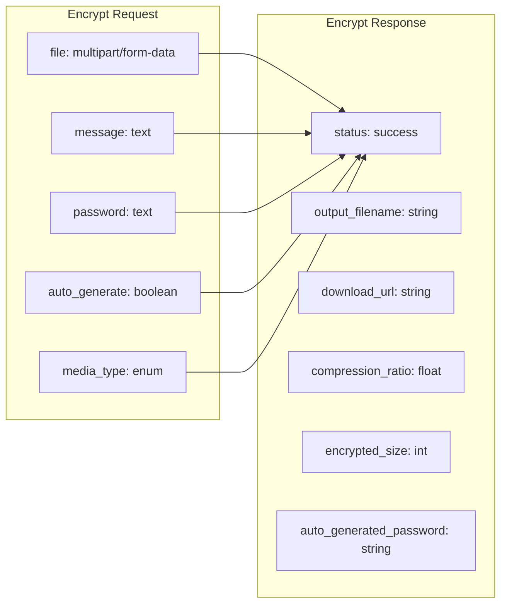

---

## 7. Data Formats

### 7.1 Encrypted Data Structure

```
┌─────────────────────────────────────────────────────────────┐
│ Encrypted Data Format (Variable Length)                     │
├─────────────────────────────────────────────────────────────┤
│ Salt (16 bytes)          │ Random salt for PBKDF2           │
├─────────────────────────────────────────────────────────────┤
│ IV (16 bytes)            │ Random IV for AES-CBC             │
├─────────────────────────────────────────────────────────────┤
│ Compression Marker (1)   │ 0x00 = Compressed, 0xFF = Not    │
├─────────────────────────────────────────────────────────────┤
│ Ciphertext (Variable)    │ AES-256-CBC encrypted data       │
│                          │ (PKCS7 padded)                   │
└─────────────────────────────────────────────────────────────┘
```

### 7.2 Packaged Data Structure

```
┌─────────────────────────────────────────────────────────────┐
│ Packaged Data Format (For Embedding)                        │
├─────────────────────────────────────────────────────────────┤
│ Encrypted Data (Variable) │ Salt + IV + Marker + Ciphertext │
├─────────────────────────────────────────────────────────────┤
│ Separator (1 byte)        │ 0x01 marker byte                │
├─────────────────────────────────────────────────────────────┤
│ Password (Variable)      │ UTF-8 encoded password          │
│                          │ (Optional, if auto-generated)    │
└─────────────────────────────────────────────────────────────┘
```

### 7.3 Binary Embedding Format

```
┌─────────────────────────────────────────────────────────────┐
│ Binary String Format (For LSB Embedding)                    │
├─────────────────────────────────────────────────────────────┤
│ Bit Stream (Variable)    │ Each byte converted to 8 bits    │
│                          │ Bits embedded in LSB positions   │
├─────────────────────────────────────────────────────────────┤
│ Terminator (8 bits)       │ 00000000 (null byte)            │
└─────────────────────────────────────────────────────────────┘
```

---

## 8. Implementation Details

### 8.1 Key Algorithms

#### Encryption Algorithm
- **Algorithm**: AES-256-CBC
- **Key Derivation**: PBKDF2-HMAC-SHA256 (100,000 iterations)
- **Padding**: PKCS7
- **IV Generation**: Cryptographically secure random (16 bytes)

#### Compression Algorithm
- **Method**: zlib (level 9 - maximum compression)
- **Conditional**: Only applied if size reduction achieved
- **Marker**: 0x00 (compressed) or 0xFF (not compressed)

#### Steganography Algorithm
- **Method**: Least Significant Bit (LSB)
- **Distribution**: Sequential embedding across channels
- **Termination**: Null byte (0x00) terminator

### 8.2 File Processing Pipeline

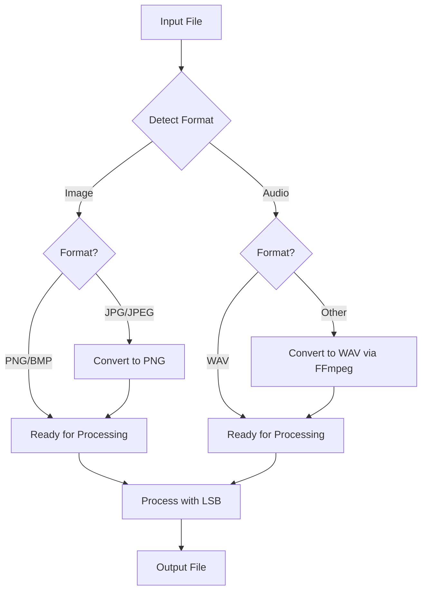

### 8.3 Error Handling Strategy

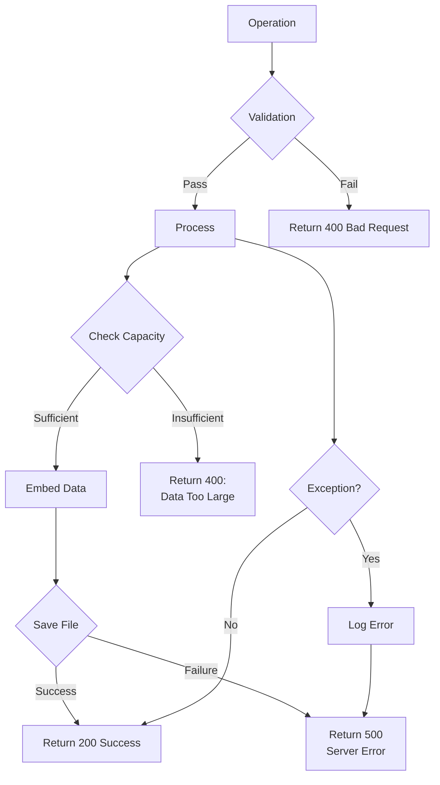

---

## 9. Performance Considerations

### 9.1 Processing Times

- **Image Processing**: ~100-500ms for typical images (1024x768)
- **Audio Processing**: ~200-1000ms depending on file size
- **QR Code Generation**: ~50-200ms
- **Encryption/Decryption**: ~10-50ms for typical messages

### 9.2 Capacity Limits

| Media Type | Capacity Formula | Example |
|------------|------------------|---------|
| Image | width × height × 3 bits | 1024×768 = ~294KB |
| Audio | sample_count bits | 1 min @ 44.1kHz = ~2.6MB |
| QR Code | Version dependent | Version 40 = ~2.9KB |

### 9.3 Optimization Strategies

- **Lazy Compression**: Only compress if beneficial
- **Format Conversion**: Batch operations where possible
- **Memory Management**: Stream processing for large files
- **Caching**: Temporary file cleanup after processing

---

## 10. Security Considerations

### 10.1 Threat Model

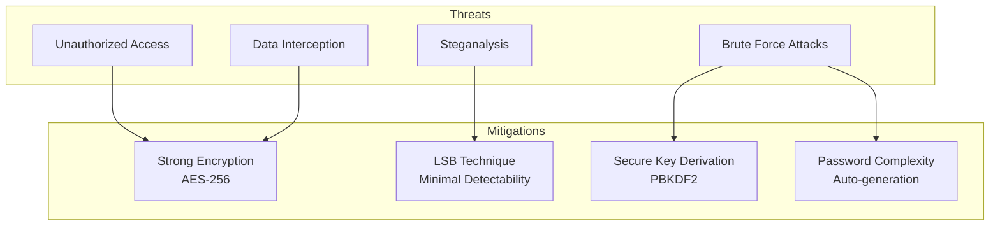

### 10.2 Best Practices

1. **Password Security**: Use auto-generated passwords for maximum security
2. **File Integrity**: Avoid modifying steganographic files (resizing, cropping, etc.)
3. **Format Preservation**: Always use PNG for images, WAV for audio
4. **Capacity Planning**: Ensure carrier file is large enough for message
5. **Secure Transmission**: Use HTTPS for web interface, secure channels for file transfer

---

## 11. Future Enhancements

### 11.1 Planned Features

- Video file steganography support
- Advanced steganography techniques (DCT, FFT)
- Multi-layer encryption
- Distributed steganography across multiple files
- Steganalysis detection tools
- Enhanced QR code styles and customization

### 11.2 Scalability Improvements

- Asynchronous processing for large files
- Queue-based job processing
- Distributed processing support
- Cloud storage integration
- API rate limiting and throttling

---

## 12. Conclusion

SteganoTool Enhanced provides a robust, secure, and user-friendly platform for steganographic operations. The system's architecture supports multiple media types, implements strong encryption, and provides both web and command-line interfaces. The use of industry-standard algorithms (AES-256, PBKDF2) ensures security, while the LSB technique maintains carrier file integrity.

The modular design allows for easy extension and maintenance, making it suitable for both educational and production environments. The comprehensive API design enables integration with other systems, while the dual interface approach accommodates different user preferences.

---

## Appendix A: API Reference

### A.1 Encryption Endpoint

**Endpoint**: `POST /api/encrypt`

**Request**:
- `file` (multipart/form-data): Carrier file
- `message` (form-data): Message to hide
- `password` (form-data): Encryption password (optional if auto_generate=true)
- `auto_generate` (form-data): Boolean flag for auto-password generation
- `media_type` (form-data): "image" | "audio"

**Response**:
```json
{
  "status": "success",
  "output_filename": "stego_image.png",
  "download_url": "/api/download/stego_image.png",
  "compression_ratio": 45.2,
  "encrypted_size": 1024,
  "auto_generated_password": "Abc123!@#"
}
```

### A.2 Decryption Endpoint

**Endpoint**: `POST /api/decrypt`

**Request**:
- `file` (multipart/form-data): Steganographic file
- `password` (form-data): Decryption password (optional if embedded)
- `media_type` (form-data): "image" | "audio"

**Response**:
```json
{
  "status": "success",
  "message": "Decrypted message text",
  "message_length": 150,
  "password_found": true
}
```

---

## Appendix B: Glossary

- **LSB (Least Significant Bit)**: The rightmost bit in a binary number, changing it has minimal impact on the value
- **Steganography**: The practice of hiding information within other non-secret data
- **Stego File**: A file containing hidden steganographic data
- **Carrier File**: The original file used to hide data
- **PBKDF2**: Password-Based Key Derivation Function 2, used for key generation
- **IV (Initialization Vector)**: Random data used to initialize encryption algorithms
- **CBC (Cipher Block Chaining)**: A mode of operation for block ciphers

---

**Document Version**: 1.0  
**Last Updated**: 2024  
**Author**: Technical Documentation Team

